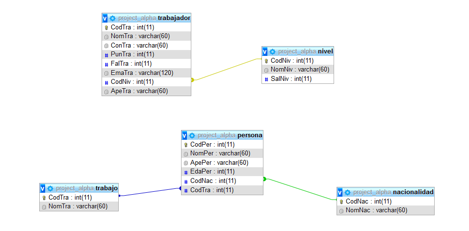
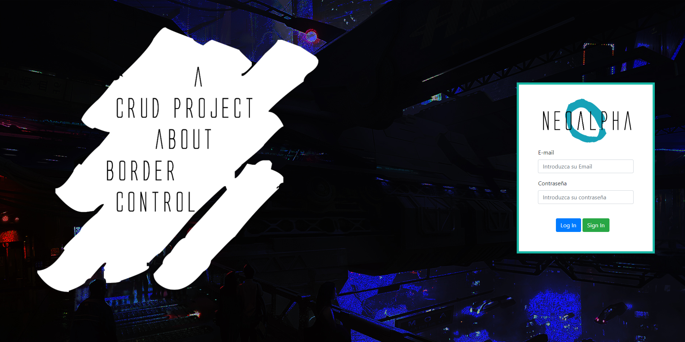
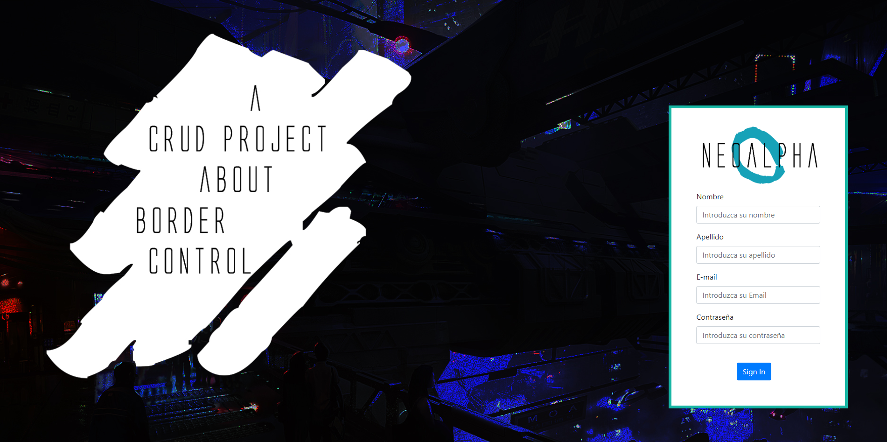
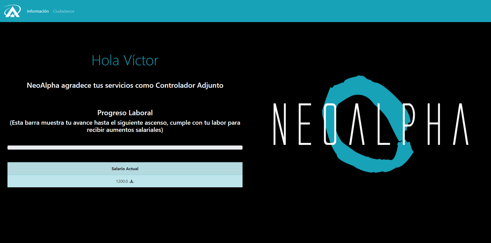
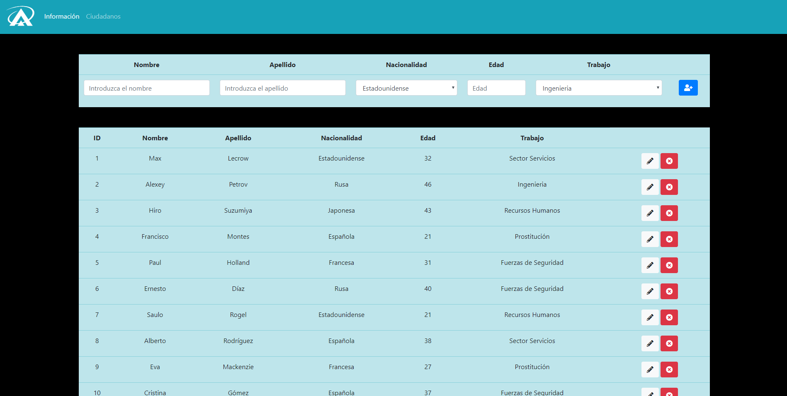

# Control de Fronteras

## ¡Bienvenido al control de fronteras de NeoAlpha!

Se trata de un CRUD que controla las personas que salen y entran dentro una utopía futurística ficticia.

## Índice
1. DATABASE
2. Login
3. Sign In
4. Panel Principal
5. Ciudadanos

## DATABASE

Está por compuesta por 5 tablas, 2 de ellas albergan datos sobre los trabajadores y el resto sobre los ciudadanos.

## Login

Primera vista del CRUD, desde aquí puedes entrar a los diferentes perfiles de los trabajadores.

## Sign In

Pantalla de registro de los trabajadores, desde aquí el usuario puede crear nuevos perfiles.

## Panel Principal

¡El gran salón del CRUD! Desde aquí los trabajadores pueden encontrar información sobre su puesto actual, su sueldo e incluso el trabajo restante hasta el próximo ascenso.

## Ciudadanos

El corazón del CRUD, desde aquí los trabajadores pueden acceder a un listado de todos los ciudadanos además de añadir, borrar o modificar los datos de los ya existentes.

# (Esta versión solo es una versión temprana del CRUD, están previstas diversas actualizaciones en las semanas venideras)
